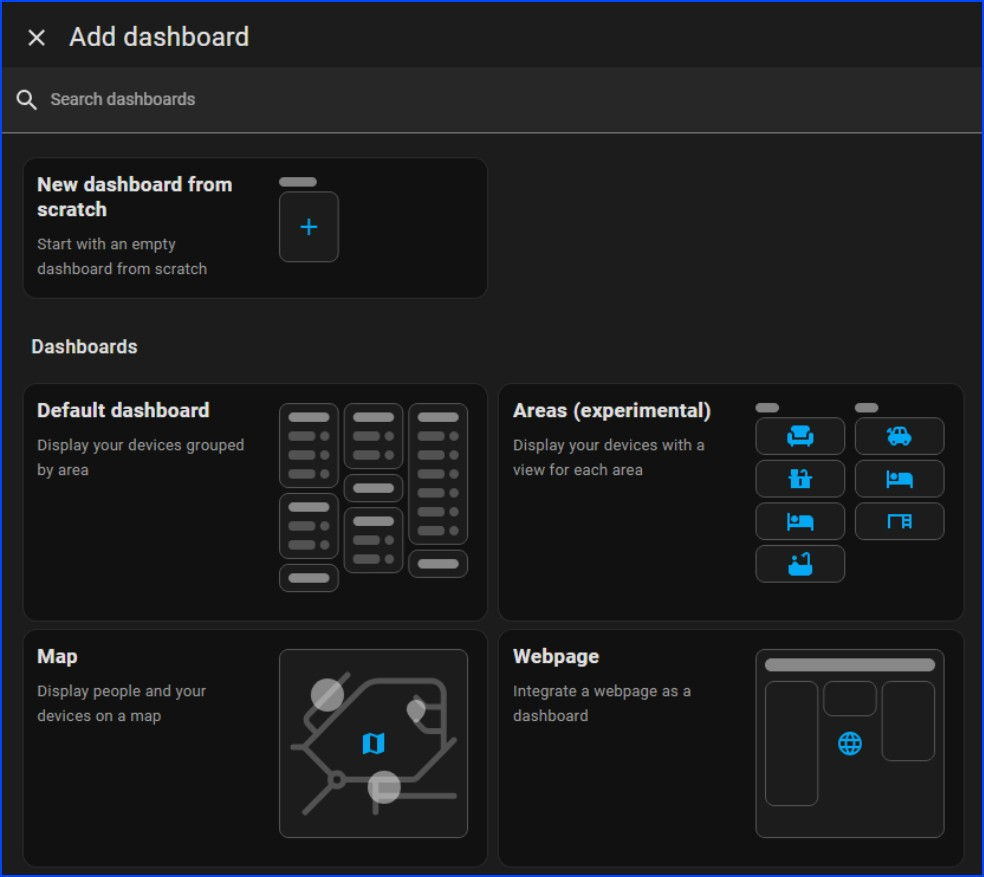
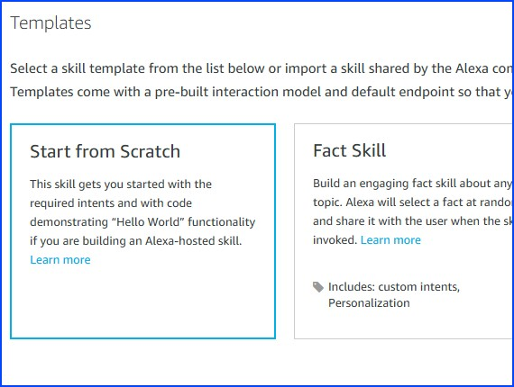
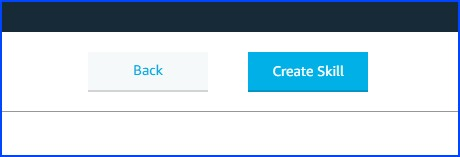
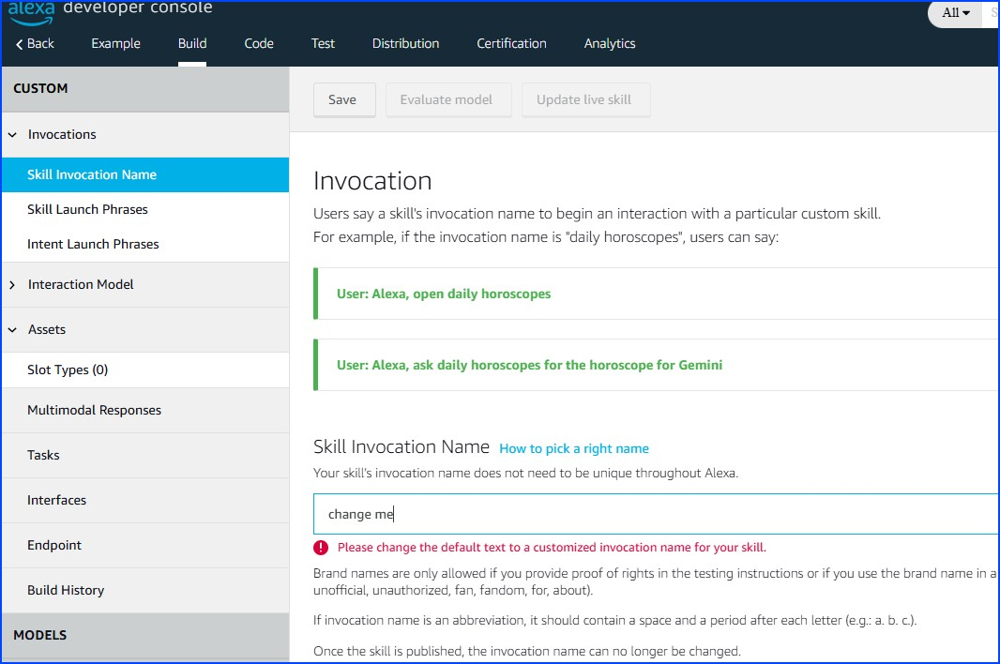
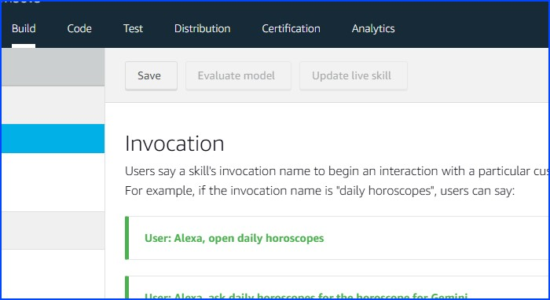
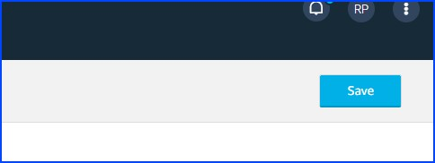
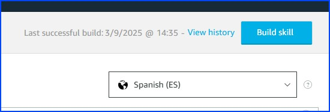
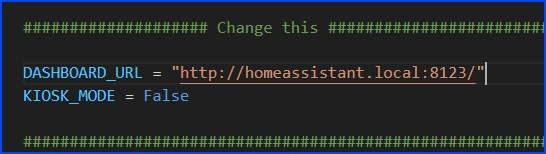
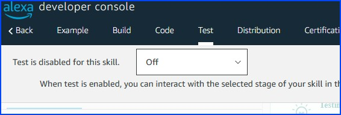

# Installation

1. In Home Assistant, go to Configuration > Dashboards and press the "Add Dashboard" button. 

3. Open the dashboard (click on "open"), click on "Edit Dashboard" in the top right corner.

4. Edit the view "Home" if you want.

5. You can now create your view as you like. Remember to adjust the elements according to the screen you are going to use.

6. Now we're finished in Home Assistant. Open the [Alexa Developer Console](https://developer.amazon.com/alexa/console/ask) and sign-in with the Amazon account that is linked to your Echo Show.

7. I recommend switching the language of the Alexa Developer Console to "English (US)" in the bottom left corner. This will make following these instructions much easier.

8. Click on "Create Skill".

9. Enter a skill name (I chose "Dashboard Viewer") and make sure that the correct locale is selected (the language you use for your Echo Show). Select "Other" or "Smart Home" for the type experience. For the model select "Custom" and for the backend select "Alexa-hosted (Python)". Choose the region closest to you. For Europe, it has to be Ireland.

10. Choose "Start from Scratch" in the templates page and press "Next". 

11. In the top right corner press "Create skill" 

12. You should now be on this page. 

13. In the menu on the left select "Invocations" > "Skill Invocation Name". Here you can set the name of your skill. You will use this name to call the skill. We will use "dashboard viewer", however, if the language of your Alexa device differs from English it might be useful to choose something in your language (Alexa might not understand it otherwise). 

14. On the top click "Save". 

15. Again in the left menu navigate to "Interfaces". Activate the option "Alexa Presentation Language".

16. Click on "Save". 

17. Then again in the left menu navigate to "Intents" and click "Build Skill".

18. Wait until you get the notification "Build Completed". Afterwards navigate to the Code tab.

19. In the code editor replace the content of the ``lambda_function.py`` file with the content of the ``lambda_function.py`` file from this repository. It can be found [here](lambda_function.py). Change the ``DASHBOARD_URL`` variable according to your setup. If you want to open the specific dashboard add the dashboard URL to the main URL. Assuming our Home Assistant URL is ``https://homeassistant.local:8123``, the ``DASHBOARD_URL`` should be ``https://homeassistant.local:8123/``. If you want to specifiy the dashboard URL, the ``DASHBOARD_URL`` should be ``https://homeassistant.local:8123/dashboard_url/``. 
You can use [Kiosk Mode](https://github.com/maykar/kiosk-mode) to hide the header and sidebar drawer from Home Assistant. If you have [Kiosk Mode](https://github.com/maykar/kiosk-mode) installed you can use the ``KIOSK_MODE`` variable to enable/disable Kiosk mode. If you don't have [Kiosk Mode](https://github.com/maykar/kiosk-mode) installed, this option won't have any effect, therefore you can set it to ``False``. When you are finished, click on "Save". 

20. Right-click on the ``lambda`` folder and select "Create File". 

21. Select ``lambda/template.json`` as file path. 

22. Paste the contents of the ``template.json`` from this repository (which can be found [here](template.json)) into the newly created ``template.json`` file. 

23. Click on "Save" and on the "Deploy" button. Wait until you get the notification "Deployment Successful". 

24. Navigate to the "Test" tab. 

25. Select "Test is disabled for this skill: Development" (change OFF to development) from the dropdown and you are done 🎉. 

26. You can test the skill by opening it on your Alexa device. Since we chose ``dashboard viewer`` as the invocation name, we would open the skill by saying ``Alexa, open dashboard viewer``. This should open the default view of the dashboard. If you never signed in to your Home Assistant account on your Echo Show, you might need to do this then. Make sure to select the "keep me logged in" option because you don't want to this every time you open this skill. When this works, you can test out if the view selection works.
